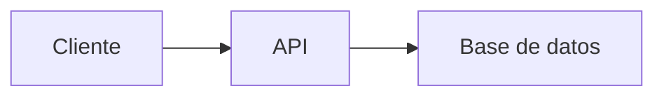

     # Estudio de Roles Básicos en Desarrollo Web y Móvil
## 0) Integrantes del equipo de estudio y sus responsabilidades en el repositorio
- Luis García lgarciada@unsa.edu.pe
- Richard Negron rnegron@unsa.edu.pe
- Valeria Ticona Nina vticonan@unsa.edu.pe (QA)
- Dayla Kyara Ticona Salgado dticonasa@unsa.edu.pe (QA)
- Brigitte Karolay Velasquez Puma  bvelasquezp@unsa.edu.pe (QA)
- Jhovi José Cusi Quicaño jcusiq@unsa.edu.pe (Android)
- Rodrigo Mamani Muñoz rmamanimu@unsa.edu.pe (Android)
## 1) Conceptos Generales para tener en cuenta
En el contexto de desarrollo web y móvil: diferencias entre librerías, frameworks y patrones de diseño.

## 2) Conociendo Git
Describiremos cómo nos sirve localmente para poder versionar nuestro software.

## 3) Conociendo Github  
- Describiendo el uso de repositorio remoto  
- Cómo definimos repositorio  
- Cómo configurar para permitir al equipo colaborar  
- Supervisión de posibles conflictos  

### Temas a desarrollar por los miembros del Equipo:  
Roles básicos en el desarrollo de aplicaciones web y aplicación móvil

## 4) Desarrollador Frontend *Cada uno complete lo que le corresponda*
- Descripción del rol: El desarrollo frontend se enfoca en la creación de la interfaz visual y la experiencia del usuario en una página web. Utiliza HTML, CSS y JS para construir páginas interactivas y responsivas. Su objetivo principal es garantizar que los usuarios puedan interactuar de forma intuitiva, rápida y eficiente con el sitio o aplicación. 
- Habilidades requeridas:
     - HTML/CSS: Maquetación y diseño de páginas web.
     - JavaScript: Interactividad y lógica del lado del cliente.
     - Frameworks: Desarrollo eficiente y estructurado.
     - Control de versiones (Git): Seguimiento y colaboración en código.
     - Diseño UI/UX básico: Crear interfaces amigables y atractivas.
- Relación con roles de Backend, QA, Desarrollador Android: El frontend se conecta con el backend mediante APIs para mostrar datos, y colabora con QA para asegurar calidad visual y funcional. También trabaja en paralelo con desarrolladores Android, creando interfaces similares en distintas plataformas.   
- Stack tecnológico:  
  - Lenguajes  
  - Frameworks   

## 4.1) Links recomendados para capacitación Rol Frontend *Cada uno complete lo que le corresponda*
🔹 Sin certificaciones:
     - developer.mozilla.org
     - www.w3schools.com
     - css-tricks.com
     - javascript.info
🔹 Con certificación:
     - www.freecodecamp.org
     - www.sololearn.com
     - learn.microsoft.com
     - www.coursera.org
🔹 Proyectos completos de ejemplo
🔹 Recomendadas por líderes (Microsoft, AWS, Google) 

## 5) Desarrollador Backend 
- Descripción del rol: El desarrollador backend se encarga de construir y mantener la lógica interna de una aplicación, gestionando bases de datos, servidores y APIs para garantizar que el sistema funcione correctamente y sea seguro.
- Habilidades requeridas:
   - Conocimiento de Lenguajes de Programación: Como Java, Python, Ruby, entre otros.
   - Medidas de seguridad: Para proteger datos y sistemas.
   - Integración con Frontend: Capacidad para integrar el backend con el frontend, a menudo utilizando tecnologías como HTML, CSS y JavaScript.
   - Comunicación: Ser efectiva tanto oral como escrita para colaborar con otros miembros.
   - Resolución de problemas: Capacidad para analizar, reconocer, resolver incidencias. 
   
- Relación con roles de Frontend, QA, Desarrollador Android:
   - Frontend: El frontend envia señales al backend, el backend procesa estas mismas y envia la información necesaria para que el frontend lo muestre en su interfaz.
   - QA: Estos dos roles mantienen  una estrecha comunicación para que el producto realizado satisfaga las necesidades del usuario. Probar la seguridad, bases de datos y el rendimiento, es fundamental.
   - Desarrollador Android: Trabajan en conjunto para crear aplicaciones funcionales. El backend se encarga de la lógica del servidor, bases de datos y APIs, mientras que el desarrollador Android diseña la interfaz y consume esos servicios
- Stack tecnológico:  
  - Lenguajes  
  - Frameworks 
  - Base de datos

## 5,1) Links recomendados para capacitación Rol Backend 
🔹 Sin certificaciones
  -https://scikit-learn.org/stable/# 
🔹 Con certificación  
  - https://www.codecademy.com/learn
  - https://cursa.app/en/free-course/back-end-ecgh?utm_source=chatgpt.com
  - https://www.oracle.com/mx/education/oracle-next-education/
  - https://www.oracle.com/mx/education/oracle-next-education/

🔹 Proyectos completos de ejemplo  
🔹 Recomendadas por líderes (Microsoft, AWS, Google) 

## 6) Rol QA
- Descripción del rol: En las empresas tecnológicas, asegurar la calidad del software es tan importante como desarrollarlo. Aquí es donde entra el rol de QA (Quality Assurance).
El QA no solo detecta errores, sino que trabaja desde etapas tempranas del proyecto para prevenir fallos y garantizar que el producto funcione correctamente.
Este rol aporta valor al desarrollo al enfocarse en la funcionalidad, eficiencia y satisfacción del usuario, además de fortalecer la comunicación con otros equipos como frontend, backend y producto.
- Funciones:
     - Revisión: El QA analiza los requerimientos del sistema para detectar errores o ambigüedades desde el inicio del proyecto.
     - Pruebas: Diseña y ejecuta pruebas para asegurarse de que cada función del software opere correctamente.
     - Detección de errores: Identifica fallos en el sistema, los documenta y los comunica al equipo de desarrollo para que sean corregidos.
     - Validación final: Comprueba que los errores corregidos no hayan generado nuevos problemas y que el sistema esté listo para ser lanzado.
- Habilidades requeridas:
     - Habilidades Técnicas:
          - Conocimiento de metodologías de testing: Test cases, planes de prueba y estrategias de testing (manual y automatizado).
          - Fundamentos de software: Comprender los conceptos básicos del ciclo de vida del software (SDLC), tipos de testing.
          - Automatización de pruebas: Selenium, Cypress, JMeter, Appium, Postman, o similares para automatizar pruebas funcionales, de API y de carga.
          - Manejo de herramientas de gestión: Jira, TestRail, Zephyr, Quality Center para reportes de bugs, gestión de incidencias y seguimiento de pruebas.
          - Conocimientos de al menos un scripting/código: Python, Java, JavaScript, etc.
     - Habilidades Blandas:
          - Pensamiento analítico y crítico
          - Detallismo y precisión
          - Comunicación efectiva
- Relación con roles de Frontend, Backend, Desarrollador Android:
     - Frontend: QA prueba la interfaz que ve el usuario final: botones, formularios, menús, navegación, etc.
     - Backend: Devuelva respuestas correctas. Tenga buen manejo de errores. (Pruebas de API).
     - Android: Funcione en distintos dispositivos Android, resoluciones y versiones del sistema operativo. No tenga fallas al instalarse, abrirse o cerrarse.
- Stack tecnológico:  
  - Lenguajes  
  - Frameworks 

## 6.1) Links recomendados para capacitación Rol QA 
🔹 Sin certificaciones  

- Testing Al Grano – UPEX Galaxy (YouTube)
    > https://www.youtube.com/watch?v=Fv5ROH9D14o

🔹 Con certificación  

Nivel Principiante:
- Testea y Conecta: 20 dias de QA en Apps Descentralizadas.(Certificado de participación + POAP)
    > https://academiaqa.com/courses/20-dias-qa/ 
- Quality Assurance (QA) - Techniques and Methodologies
    > https://alison.com/course/quality-assurance-qa-techniques-and-methodologies (Certificación de pago)
- Curso de Tester de Software
    > https://edutin.com/curso-de-tester (Certificación de pago)

Nivel Intermedio:
- Best Quality Assurance Courses
    > https://alison.com/tag/quality-assurance (Certificación de pago)
- QA Process Optimization: Agile & Automated Testing
    > https://www.coursera.org/learn/qa-process-optimization-agile-automated-testing (Certificación de pago)
- Free Quality Assurance Bootcamp
    > https://www.codingtemple.com/free-courses/quality-assurance/

🔹 Proyectos completos de ejemplo  
🔹 Recomendadas por líderes (Microsoft, AWS, Google) 

## 6.2) Ejemplo práctico del rol de QA  
**Autora:** Brigitte Karolay Velasquez Puma  

### Caso hipotético: QA en una aplicación de banca móvil

Para comprender mejor el rol del Quality Assurance (QA), presentaremos un caso aplicado en una **app de banca móvil**, un entorno que exige seguridad, precisión y una experiencia fluida para el usuario.

#### Acciones concretas del QA en este contexto:

- **Revisión de funcionalidades críticas**: Verificar que procesos clave como el inicio de sesión, la consulta de saldo y las transferencias bancarias funcionen correctamente.
- **Pruebas en diferentes dispositivos**: Ejecutar pruebas en distintos sistemas operativos (Android/iOS) y resoluciones para asegurar la compatibilidad del producto.
- **Automatización de pruebas recurrentes**: Utilizar herramientas como **Selenium** o **Postman** para validar funcionalidades repetitivas o API del backend.
- **Detección y documentación de errores**: Reportar fallos en herramientas como **Jira**, especificando pasos para reproducirlos y su prioridad.
- **Pruebas de regresión**: Validar que los errores corregidos no generen nuevos problemas en otras partes del sistema.

### Impacto del QA en el resultado final

Gracias al trabajo del QA:
- Se entrega una aplicación **estable, segura y funcional**.
- Se previenen errores antes de llegar al usuario final, lo cual **reduce costos** y evita daños a la reputación del producto.
- Se garantiza la **satisfacción del usuario**, uno de los pilares mencionados en la descripción del rol de QA por nuestro equipo.

## 6.3) Conclusiones generales sobre el rol de QA

El rol de QA, como vimos a lo largo del trabajo, **no solo busca encontrar errores**, sino también **prevenirlos**, aportar calidad desde las primeras fases y colaborar activamente con los equipos de desarrollo.

### Conclusiones principales:

- **El QA aporta valor desde el análisis de requisitos hasta el producto final**, validando que se cumplan los estándares de calidad.
- **Trabaja en constante comunicación con frontend, backend, UX/UI y producto**, como se explicó anteriormente.
- **Requiere habilidades técnicas y blandas**, como pensamiento crítico, precisión, conocimiento de herramientas y buena comunicación.
- **Es fundamental en entornos ágiles**, donde se requiere entregar versiones funcionales constantemente.

>  *"Un producto sin calidad es un producto que no está terminado."*
## Apoyo visual – Ejemplo práctico y proceso QA

| QA validando banca móvil | Ciclo básico del proceso QA |
|--------------------------|-----------------------------|
| | |

---

## 🔗 Referencias internas

- Ver sección **Funciones del QA**: Donde se detallan las actividades como revisión, pruebas, reporte de errores y validación final.
- Ver sección **Herramientas**: Relación directa con las mencionadas (Selenium, Postman, Jira).
- Ver sección **Relación con otros roles**: QA colabora con Frontend (interfaz), Backend (API), y Android (dispositivos móviles).


## 7) Desarrollador Android *Cada uno complete lo que le corresponda*
 - Descripción del rol: El programador de Android es un profesional especializado en crear, diseñar y  mantener aplicaciones móviles para dispositivos con sistema operativo Android. Su trabajo combina habilidades de programación, diseño de interfaces y lógica de negocio para crear aplicaciones funcionales, atractivas y eficientes que cumplan con las necesidades del usuario y los estándares de Google. Android es un sistema operativo móvil de código abierto basado en el núcleo de Linux (Linux Kernel). Fue diseñado principalmente para dispositivos móviles con pantalla táctil, como teléfonos inteligentes y tabletas.
- Habilidades requeridas: 
      - Dominio de Kotlin o Java
      - Experiencia con Android Jetpack
      - Manejo de herramientas de control de versiones (Git).
      - Uso de herramientas de JUnit, Espresso.
      - Conocimiento de patrones de arquitectura como MVVM, MVP o Clean Architecture.
      - Experiencia en publicación y mantenimiento de apps en Google Play Store.
      - Conocimientos de integración con APIs REST y manejo de JSON.8) Rol QA *Cada uno complete lo que le corresponda*
- Descripción del rol: En las empresas tecnológicas, asegurar la calidad del software es tan importante como desarrollarlo. Aquí es donde entra el rol de QA (Quality Assurance).
El QA no solo detecta errores, sino que trabaja desde etapas tempranas del proyecto para prevenir fallos y garantizar que el producto funcione correctamente.
Este rol aporta valor al desarrollo al enfocarse en la funcionalidad, eficiencia y satisfacción del usuario, además de fortalecer la comunicación con otros equipos como frontend, backend y producto.
- Funciones:
     - Revisión: El QA analiza los requerimientos del sistema para detectar errores o ambigüedades desde el inicio del proyecto.
     - Pruebas: Diseña y ejecuta pruebas para asegurarse de que cada función del software opere correctamente.
     - Detección de errores: Identifica fallos en el sistema, los documenta y los comunica al equipo de desarrollo para que sean corregidos.
     - Validación final: Comprueba que los errores corregidos no hayan generado nuevos problemas y que el sistema esté listo para ser lanzado.
- Habilidades requeridas:
     - Habilidades Técnicas:
          - Conocimiento de metodologías de testing: Test cases, planes de prueba y estrategias de testing (manual y automatizado).
          - Fundamentos de software: Comprender los conceptos básicos del ciclo de vida del software (SDLC), tipos de testing.
          - Automatización de pruebas: Selenium, Cypress, JMeter, Appium, Postman, o similares para automatizar pruebas funcionales, de API y de carga.
          - Manejo de herramientas de gestión: Jira, TestRail, Zephyr, Quality Center para reportes de bugs, gestión de incidencias y seguimiento de pruebas.
          - Conocimientos de al menos un scripting/código: Python, Java, JavaScript, etc.
     - Habilidades Blandas:
          - Pensamiento analítico y crítico
          - Detallismo y precisión
          - Comunicación efectiva
- Relación con roles de Frontend, Backend, Desarrollador Android:
     - Frontend: QA prueba la interfaz que ve el usuario final: botones, formularios, menús, navegación, etc.
     - Backend: Devuelva respuestas correctas. Tenga buen manejo de errores. (Pruebas de API).
     - Android: Funcione en distintos dispositivos Android, resoluciones y versiones del sistema operativo. No tenga fallas al instalarse, abrirse o cerrarse.
- Stack tecnológico:  
  - Lenguajes  
  - Frameworks 

## 8) Links recomendados para capacitación Rol QA *Cada uno complete lo que le corresponda*
🔹 Sin certificaciones  

- Testing Al Grano – UPEX Galaxy (YouTube)
    > https://www.youtube.com/watch?v=Fv5ROH9D14o

🔹 Con certificación  

Nivel Principiante:
- Testea y Conecta: 20 dias de QA en Apps Descentralizadas.(Certificado de participación + POAP)
    > https://academiaqa.com/courses/20-dias-qa/ 
- Quality Assurance (QA) - Techniques and Methodologies
    > https://alison.com/course/quality-assurance-qa-techniques-and-methodologies (Certificación de pago)
- Curso de Tester de Software
    > https://edutin.com/curso-de-tester (Certificación de pago)

Nivel Intermedio:
- Best Quality Assurance Courses
    > https://alison.com/tag/quality-assurance (Certificación de pago)
- QA Process Optimization: Agile & Automated Testing
    > https://www.coursera.org/learn/qa-process-optimization-agile-automated-testing (Certificación de pago)
- Free Quality Assurance Bootcamp
    > https://www.codingtemple.com/free-courses/quality-assurance/

🔹 Proyectos completos de ejemplo  
🔹 Recomendadas por líderes (Microsoft, AWS, Google) 
- Relación con roles de Frontend, Backend, QA:
      - Frontend en Android: Colabora para mantener la consistencia en  la experiencia de usuario.
      - Backend: Colabora para crear servicios, reportar errores y validar endpoints.
      - QA (Quality Assurance): Trabaja en conjunto para garantizar calidad mediante pruebas manuales y automatizadas asi como la corrección de bugs.
- Stack tecnológico:  
  - Lenguajes: 
      - Kotlin 
      - Java
  - Frameworks 
      - Android SDK
      - Jetpack Compose
      - Firebase
      - Retrofit
      - Coroutines
      - RxJava

## 9) Links recomendados para capacitación Rol Android *Cada uno complete lo que le corresponda*
🔹 Sin certificaciones  
Android Developers - Oficial 
https://developer.android.com/guide

Google Codelabs - Android
https://codelabs.developers.google.com/?cat=Android

Kotlin Lang - Tutoriales oficiales
https://kotlinlang.org/docs/home.html

freeCodeCamp - Curso de Android en Youtube 
https://youtu.be/fis26HvvDII?si=1154Bd8Arp0GEtN3

Curso de Android en Udacity
https://www.udacity.com/course/developing-android-apps-with-kotlin--ud9012
🔹 Con certificación  
Nivel principiante:

Google: Android Basics in Kotlin
https://developer.android.com/courses/android-basics-kotlin/course

Coursera - Fundamentos de Android (UNAM)
https://www.coursera.org/learn/fundamentos?utm_source=chatgpt.com

Nivel intermedio 

Coursera - Meta Android Developer Professional Certificate
https://www.coursera.org/professional-certificates/meta-android-developer

Udemy - The Complete Android App Developer Bootcamp
https://www.udemy.com/course/the-complete-android-10-developer-course/
🔹 Proyectos completos de ejemplo  
🔹 Recomendadas por líderes (Microsoft, AWS, Google) 

## 10) Pasos a Desarrollar  
1. Luis García crea repositorio remoto: `RepositorioTrabajo`  
2. Compartir el repositorio con compañeros:  
   - Ir a Settings ⚙️ > Collaborators  
   - Invitar usando nombre de usuario GitHub o email registrado  
3. **Compañeros invitados**:  
   - Recibirán invitación por email  
   - Clonar repositorio:  
     ```bash
     cd practica
     git clone https://github.com/jjuarez29/EstudioRolesBasicos
     cd EstudioRolesBasicos
     ```
   - Ver contenido con `dir` (Windows) o `ls` (Linux/Mac)
ejemplo de link

## Conociendo algo de mermaid y markdown
**Mermaid** y **Markdown** son herramientas complementarias pero con propósitos diferentes. Aquí te explico sus diferencias y similitudes:

---

### 🔹 **Markdown** (`.md`)
Es un **lenguaje de marcado ligero** para formatear texto plano de manera sencilla, que se convierte en HTML.

**Características**:
1. **Sintaxis simple**: Usa símbolos como `#`, `*`, `>` para títulos, listas, citas, etc.
   ```markdown
   # Título
   - Lista
   **negrita**
   ```
2. **Propósito principal**: Documentación legible en repositorios (como `README.md`).
3. **Soporte nativo en GitHub/GitLab**: Se renderiza automáticamente.
4. **No es programable**: Solo estructura texto e imágenes.

---

### 🔹 **Mermaid**
Es una **librería de diagramación** que permite crear gráficos mediante código dentro de documentos Markdown.

**Características**:
1. **Sintaxis específica**: Usa bloques de código con la etiqueta `mermaid`.
   ````markdown
   ```mermaid
   graph TD
     A[Inicio] --> B{Decisión}
     B -->|Sí| C[OK]
     B -->|No| D[Error]
   ```
   ````
2. **Propósito principal**: Generar diagramas (flujos, UML, Gantt, etc.) sin herramientas externas.
3. **Requiere soporte**: Funciona en GitHub/GitLab con renderizadores compatibles (no en todos lados).
4. **Es programable**: Permite lógica para estructurar gráficos.

---

### 🔄 **Similitudes**
1. **Ambos usan texto plano**: Son legibles sin renderizar.
2. **Se integran en `.md`**: Mermaid vive dentro de bloques de código en Markdown.
3. **Uso en documentación**: Ideales para repositorios y wikis.

---

### 📌 **Diferencias clave**
| Característica       | Markdown                          | Mermaid                          |
|----------------------|-----------------------------------|----------------------------------|
| **Función**          | Formatear texto                   | Crear diagramas                  |
| **Sintaxis**         | `# Título`, `- lista`             | `graph TD`, `pie chart`          |
| **Renderizado**      | Soporte universal                 | Requiere compatibilidad          |
| **Ejemplo**          | Hacer listas o tablas             | Hacer flujogramas o secuencias   |

---

### 🛠 **Ejemplo combinado (Markdown + Mermaid)**
````markdown
# Documentación del Proyecto

## 📊 Diagrama de flujo


## 📝 Pasos
1. Ejecutar `npm install`
2. Abrir `index.html`
````

---

### ✅ **¿Cuándo usar cada uno?**
- **Usa Markdown** para:  
  READMEs, documentación, wikis, notas simples.  
- **Usa Mermaid** para:  
  Diagramas técnicos, arquitectura, flujos de trabajo.  

**Nota**: GitHub soporta ambos, pero verifica si tu plataforma (como Slack o GitLab) también renderiza Mermaid.
